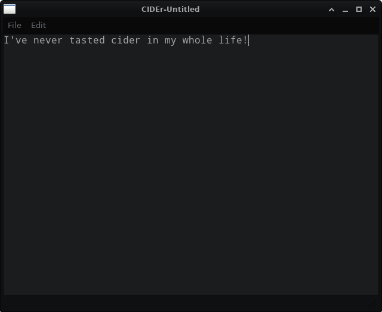

# CIDEr is a lightweight IDE for C/C++ programming

Feel free to contribute in this project.

### Why a new C++ IDE ?
#### The simple answer is that I don't feel much satisfied by current C/C++ IDEs. The good ones are the paid ones. 

## TIMELINE
### Screenshots of CIDEr whenever something changes in it's looks
#### This is just for nostalgia purposes for developers

#### GOALS
    CIDEr has 3 main goals :
    1 : Be superfast and superlight for almost all platforms.
    2 : Look good on almost all platforms.
    3 : Provide as many features as possible.

#### FEATURES
    Just created the project so only one feature : A github repo.
    1 : Create/Open/Edit/Save files

#### CLOSE RANGE TARGETS
    Here I will write down targets that I want to achieve as soon as possible. A target is a feature that is yet to be added.
    1 : Font Settings.
    2 : Syntax highlighting for C/C++ programs. 

#### LONG RANGE TARGETS
    Here I will write down targets that will give us a straight line to walk on because a line requires 2 points. I can always give close range targets but won't go anywhere
    without setting a direction to move into
    1 : Build system support (Internal).
    2 : Version control.
    3 : Code completion (Might want to use AI in long run)
    4 : Add support for other languages (Why? : because C is the father of almost all high level languages)

#### TODO 
    A TODO may or may not be a feature.
    1 : Setup logger interface for debugging CIDEr.

#### CIDEr is licensed under GPLv3
    CIDEr is a lighweight IDE for C/C++ programming.
    Copyright (C) 2021  Siddharth Mishra

    This program is free software: you can redistribute it and/or modify
    it under the terms of the GNU General Public License as published by
    the Free Software Foundation, either version 3 of the License, or
    (at your option) any later version.

    This program is distributed in the hope that it will be useful,
    but WITHOUT ANY WARRANTY; without even the implied warranty of
    MERCHANTABILITY or FITNESS FOR A PARTICULAR PURPOSE.  See the
    GNU General Public License for more details.

    You should have received a copy of the GNU General Public License
    along with this program.  If not, see <https://www.gnu.org/licenses/>.